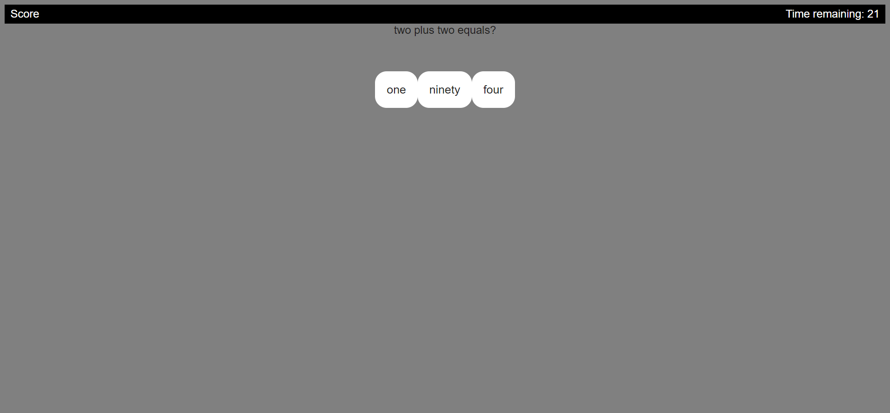

# Coding-Quiz

## Overveiw:

- When you click the start button a timer starts and you will have 30 seconds to complete the quiz.

- When you answer a question incorrectly the timer decuts 5 seconds off your total time to complete the quiz.

- When all questions are answered or the timer reaches 0 the game ends.

- When the game is over you are able to store your specific information and and save your highscores.

##  Preview 

GitHub Pages: https://kasaipreston.github.io/Coding-quiz/

GitHub Repository: https://github.com/kasaipreston/Coding-quiz

